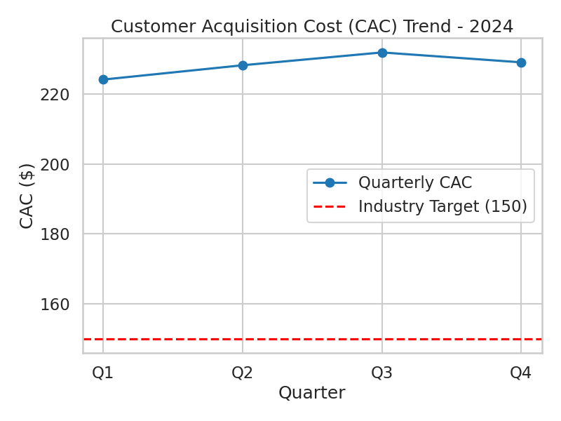

# Quarterly Customer Acquisition Cost (CAC) Analysis - 2024

**Email for verification:** 24f2000846@ds.study.iitm.ac.in

## Key Findings

- The average CAC across 2024 is **228.41**, which is substantially higher than the industry target of 150.
- CAC increased steadily from Q1 (224.21) to Q3 (231.97) and slightly decreased in Q4 (229.14).
- Despite the minor dip in Q4, the CAC remains consistently above the industry benchmark.

## Business Implications

- Higher-than-target CAC suggests inefficiencies or overly expensive customer acquisition channels.
- Sustained elevated CAC may reduce profitability and competitiveness.
- Immediate attention is required to optimize acquisition strategies to avoid eroded margins.

## Recommendations

- **Optimize digital marketing channels** to lower CAC by refining ad targeting, improving conversion funnels, and reallocating budget toward high-performing platforms.
- Investigate and reduce unnecessary spend in underperforming channels.
- Leverage data-driven marketing to identify and replicate effective strategies.
- Set quarterly CAC reduction targets aligned with reaching the industry benchmark of 150.

---

This analysis was assisted by LLM-powered tools including Jules (ChatGPT Codex).

---

